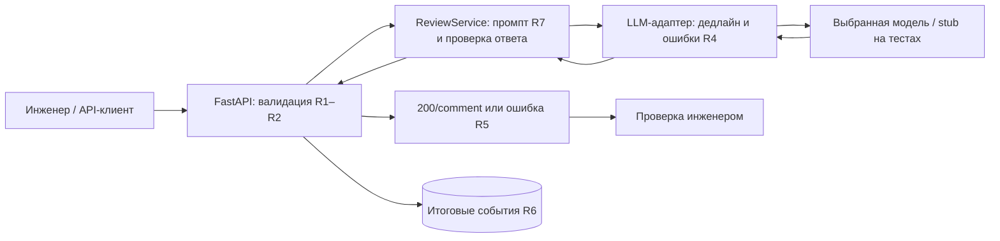
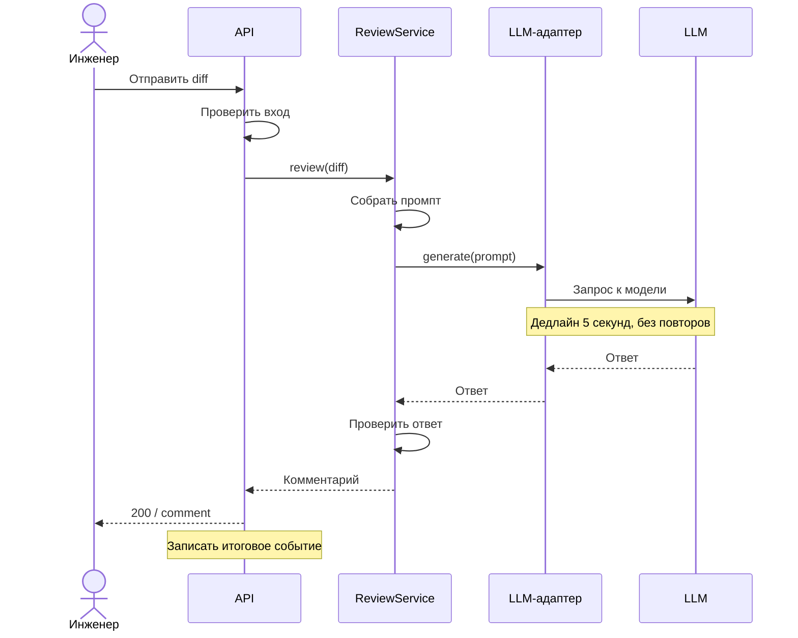

# ADR: контракт и границы первого рабочего сценария

- Статус: proposed, обновлено 17.09.2026.
- Ответственный за принятие: автор учебного проекта.
- Область: US1–US3, требования [R1–R7](context.md#context-pack).

## Контекст

`TRAINING_PR.diff:37` (`app/api.py, create_review`) обращается к `payload["diff"]`: отсутствующий ключ вызывает `KeyError`. Неверный тип существующего значения — другая проблема: f-string преобразует его в текст (`:20`). В показанном `ReviewService.review` нет перехвата ошибок, а промпт не задаёт формат аргументированного ревью (`:19–22`). Неизвестные middleware и настройки LLM не объявляются отсутствующими во всём проекте.

## Решение

1. На границе API использовать Pydantic-модель с обязательной **строгой строкой** diff, отдельно проверить непустоту после strip и предел длины исходного значения. Порядок: форма/тип/непустота → 422; затем размер → 413. Автоматическое приведение числа к строке запрещено. Для единообразного R5 нужен обработчик ошибок валидации: стандартный ответ фреймворка сам по себе не равен нашему контракту `error.code`.
2. Сервис получает уже проверенный diff, формирует инструкцию по R7 и вызывает LLM через адаптер ровно один раз. Сохранить успешный JSON `{"comment": answer}`; не добавлять неоговорённый формат списка findings в публичный API.
3. Адаптер нормализует ошибки провайдера в timeout/failure и обеспечивает общий дедлайн 5 секунд средствами сетевого клиента с отменой. Сервис проверяет непустой строковый ответ; API отображает ошибки в 504/502 по R4. Дедлайн охватывает всю операцию адаптера, включая его внутреннее ожидание; retries отключены. Таймер поверх неотменяемого потока не подходит как единственное решение.
4. При завершении запроса записывать один технический event R6 без исходного содержимого. Инженер проверяет комментарий; AI не получает полномочий approve/merge.

Механизм настройки обработчиков ошибок описан в [официальной документации FastAPI](https://fastapi.tiangolo.com/tutorial/handling-errors/). Конкретные значения статусов и собственная схема ошибки выше — наши проектные решения, а не обещание стандартного поведения библиотеки.

## Рассмотренные альтернативы

| Альтернатива | Компромисс / причина отклонения |
|---|---|
| Ручная проверка dict | Работоспособна, но схему входа и ошибки придётся поддерживать отдельно; модель лучше связывает типы и описание API |
| Только глобальный перехват KeyError | Не проверяет число/null/длину diff и может скрыть посторонние дефекты |
| Вернуть 200 с текстом ошибки в comment | Клиент не отличит сбой от результата; метрики успешности станут ложными |
| Автоматически повторять вызов LLM | Увеличивает ожидание и расходы; не нужен для первого сценария, повтор инициирует человек |
| Очередь асинхронных задач | Подходит долгим ревью, но требует идентификаторов задач, polling и хранения; отложена до замера реальной задержки |

## Последствия и риски

Пользователь получает предсказуемую ошибку, невалидный ввод не расходует вызов модели, а результат проверяет человек. Цена решения — дополнительный адаптер, обработчик валидации и новые тесты.

- Лимит символов не гарантирует лимит токенов. U2/I3 проверяют только заявленную границу; замер с выбранным токенизатором и бюджетом модели нужен перед реальным развёртыванием.
- Инструкции R7 не гарантируют защиту от prompt injection и правильность ответа. E5 включает вредоносную инструкцию внутри синтетического diff и ручную проверку доказательств.
- Неподдерживаемая адаптером отмена может оставить фоновый вызов после 504. I6 проверяет завершение операции; без этого R4 не принят.
- Доступ, квоты и защита секретов до отправки реального кода требуют отдельного решения. MVP тестируется на синтетических данных в учебном контуре.

## Архитектурная схема

Трассировка: валидация — U1–U2/I1–I3; адаптер — U4/I5–I6; ответ — U3/U5/I4/I7/E5; наблюдаемость — I8/L1–L3. Все эти продуктовые проверки пока являются планом.

## Диаграмма последовательностей

Основной успешный сценарий TO BE для `POST /api/reviews`. Это проектируемое поведение по [контракту R1–R7](context.md#context-pack).

После получения комментария инженер проверяет доказательства и принимает решение по PR.

Альтернативные исходы:

| Условие | Результат |
|---|---|
| Невалидный ввод / превышен лимит длины | 422 / 413; LLM не вызывается |
| Сбой провайдера / некорректный ответ | 502 |
| Истёк дедлайн | Отмена операции адаптера, 504 |

При любом исходе записывается ровно одно событие `review_completed` без diff, промпта и ответа LLM (R6). Формат и коды ошибок определены в R4–R5.

## Как использовали AI

- Сессия: [P1-03](prompts.md#журнал), OpenCode / anthropic/claude-sonnet-5.
- Тип: master prompt.
- Задача: подготовка архитектурного решения и альтернатив.
- Оценка результата: Предложена Pydantic-модель для валидации входа. В исходном ответе отсутствующее поле и неверный тип местами смешивались; это разные случаи.
