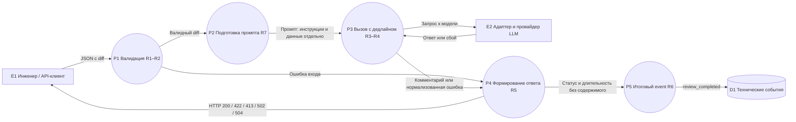

# Анализ процесса: AS IS и TO BE

## AS IS

Инженер передаёт diff → `create_review` читает `payload["diff"]` → `ReviewService.review` собирает общий промпт → `LLM.generate` возвращает текст → API отдаёт `comment`. Доказательство: `TRAINING_PR.diff:19–22,35–37`. Ручное чтение и проверка комментария — допущение выбранного пользовательского сценария, а не часть показанного кода.

В показанном пути отсутствуют проверка вложенного поля, ограничение длины и локальная обработка ошибок LLM. Формат аргументов ревью не определён. При ошибке клиенту приходится выяснять причину и повторять запрос; фактическая длительность этих операций неизвестна.

## TO BE

DFD уровня 1 изображена средствами Mermaid. Прямоугольники E — внешние сущности, круги P — процессы, цилиндр D — хранилище. Стрелки означают **потоки данных**, а не порядок ветвлений. Все процессы генерируют только обезличенные технические метаданные; P5 собирает один итоговый event на запрос. Внешняя LLM — логическая граница; сетевой провайдер выбирается при реализации.

При валидном запросе сервис вызывает LLM один раз; при невалидном — ни разу. Инженер проверяет доказательства в комментарии и сам принимает решение по PR. Данные для диагностики сохраняются без содержимого diff или ответа.

## Разница и трассировка

| Изменение | Требование | История / инкремент | Подтверждение после реализации |
|---|---|---|---|
| Строгая валидация и предел длины | R1, R2, R5 | US1 / 1 | U1–U2, I1–I3, E2–E3; M1 |
| Предсказуемый успех и отказы LLM | R3–R5 | US2 / 2 | U3–U5, I4–I7, E1, E4; M2 |
| Проверяемый комментарий для человека | R7 | US2 / 2 | U3 проверяет включение инструкций; E5 проверяет качество реального ответа; M3 |
| Диагностика и штатная нагрузка | R6 | US3 / 3 | I8, L1–L3; M4–M5 |

Общий источник контракта — [context.md](context.md#context-pack), конкретные сценарии — [product_management.md](product_management.md), архитектура — [adr.md](adr.md).

## Как использовали AI

- Сессия: [P1-04](prompts.md#журнал), OpenCode / anthropic/claude-sonnet-5.
- Тип: master prompt.
- Задача: описание AS IS и оформление TO BE в DFD.
- Оценка результата: В ответе процесс представлен через внешние сущности, процессы, потоки данных и хранилище событий.
