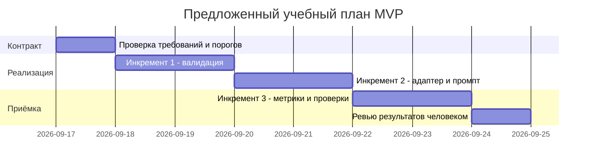

# План поставки

## Инкременты и ответственность

План предлагается для будущей реализации MVP. В Practice 1 сдаётся спецификация; даты ниже — учебное планирование от 17.09.2026, а не обещание завершённой реализации.

| Инкремент | Результат | Человек | AI | Проверка и зависимость |
|---|---|---|---|---|
| 1. Валидный вход | R1, R2, R5; US1: 422/413 вместо передачи плохого ввода в LLM | Утверждает контракт, проверяет реализацию и риски | Предлагает модель запроса, обработчик ошибок и тесты | U1–U2, I1–I3, E2–E3; после фиксации контракта |
| 2. Предсказуемое ревью | R3–R5, R7; US2: один вызов, дедлайн, нормализованные ошибки и полезный комментарий | Выбирает адаптер, проверяет отмену запроса, вручную оценивает ответы | Готовит код адаптера, промпт и сценарии отказов | U3–U5, I4–I7, E1, E4–E5; после инкремента 1 |
| 3. Наблюдаемость и приёмка | R6; US3: события, метрики M1–M5, протокол стендовых проверок | Проверяет логи, интерпретирует нагрузку и принимает результат | Помогает собрать измерения и отчёт, не выдумывает результаты | I8, L1–L3 и вся регрессия; после инкремента 2 |

## Диаграмма Ганта

## Definition of Ready / Done

DoR реализации: владелец проекта принимает или меняет предложенные лимит 10 000 символов и дедлайн 5 секунд; выбрана версия FastAPI/Pydantic и адаптер LLM с проверяемой отменой; доступны синтетические fixtures. Новые значения меняются сначала в R1–R7, затем во всех AC и проверках.

DoD инкремента: соответствующие AC подтверждены выполненными проверками, отчёт содержит входы и результаты, ошибок или утечки содержимого в логах нет, человек сделал ревью. DoD всей реализации включает E5 с реальной моделью на синтетических данных; stub не подтверждает качество генерации.

Риск поставки: адаптер может не поддерживать общий дедлайн и отмену. Тогда инкремент 2 не принят; один только timeout ожидания Python-потока не доказывает остановку внешнего вызова. Другие риски: изменение порогов требует обновить тесты; внешняя LLM может не выдержать 5 секунд — это измеряется отдельно, не скрывается увеличением дедлайна в отчёте.

## Как использовали AI

- Сессия: [P1-03](prompts.md#журнал), OpenCode / anthropic/claude-sonnet-5.
- Тип: master prompt.
- Задача: подготовка инкрементов, ролей и плана поставки.
- Оценка результата: План разбит на валидацию, обработку ошибок и наблюдаемость. Сроки являются планом, а не подтверждением выполненной реализации.
